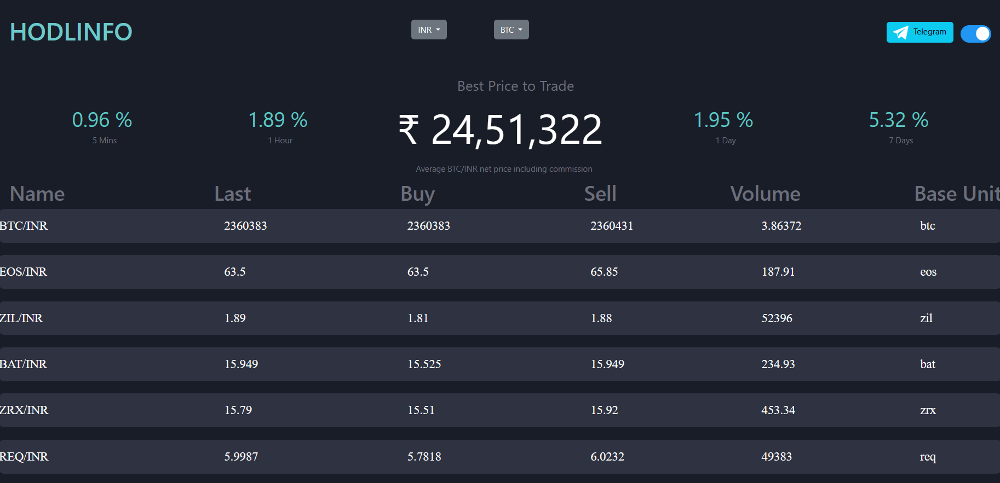

# Hodlinfo Clone

Hodlinfo Clone is a web application built to replicate the functionality and appearance of the popular cryptocurrency information website [hodlinfo.com](https://hodlinfo.com/). This project is implemented using Node.js, Express.js, PostgreSQL, and frontend technologies. It enables users to access real-time cryptocurrency data and serves as an educational and customizable platform for cryptocurrency enthusiasts and developers.

## Features

- **Real-time Cryptocurrency Data**: Fetches and displays up-to-date cryptocurrency information from the [WazirX API](https://api.wazirx.com/api/v2/tickers).

- **Data Storage**: Stores the top 10 cryptocurrency details in a PostgreSQL database for easy retrieval and historical analysis.

## Prerequisites